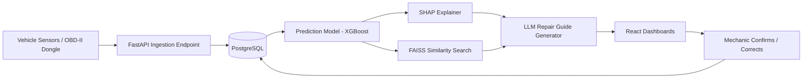

# AutoSense AI — Complete Web Platform Master Plan

*A single reference document: requirements, architecture, datasets, and full feature specs for all four dashboards — from hackathon MVP to real product.*

---

## 0. How to Use This Document

This is built to be followed top to bottom, or jumped into section by section. A few assumptions are baked in — flag anything that's wrong and it can be adjusted:

- The goal is to go beyond the hackathon slide deck and actually **build a working platform**, not just plan a pitch.
- Timeline is flexible, so every section is split into **Lean/MVP** (buildable fast, works for a hackathon demo) and **Scale-up** (what gets added once this becomes a real product/pilot).
- Four dashboards, exactly as requested: **Admin**, **Showroom/Service Center**, **Mechanic**, **Car Owner**.
- "Neat, fast, supportive" is treated as a design requirement, not just a vibe — it shows up as specific rules in Section 12.

---

## 1. Who Uses This Platform

| Role | Who they are | Their #1 job on the platform | Primary device |
|---|---|---|---|
| **Admin** | Tata Motors / platform team | Oversee every showroom, user, and AI model | Desktop |
| **Showroom Manager** | Runs one service center | Keep today's jobs moving, staff assigned, stock stocked | Desktop / tablet |
| **Mechanic** | Diagnoses & repairs vehicles | Get a trustworthy diagnosis + guide, fast | Tablet / phone |
| **Car Owner** | The customer | Know their car is fine, or know exactly what to do if it isn't | Phone (PWA) |

Each role gets its own login, its own dashboard, and never sees another role's private data — that isolation rule matters (see Section 10).

---

## 2. Dashboard 1 — Admin Panel

**Job of this dashboard:** platform-wide control room. Nobody fixes a car here — this is configuration, oversight, and analytics.

### Must-have (MVP)
- Secure login + role-based access control (RBAC)
- Home: platform KPIs — total vehicles, active alerts, jobs today, showrooms online
- Showroom management — add/edit/deactivate service centers
- User management — create/edit accounts for showroom managers, mechanics, owners; assign roles, reset access
- Vehicle registry — search/filter every vehicle on the platform
- AI model monitor — which model version is live, last retrain date, accuracy on holdout data
- Knowledge base manager — upload/replace the service manuals & technical bulletins that feed the RAG system
- Platform-wide alert feed — every critical prediction, across every showroom
- Analytics — failure-type trends, technician performance, revenue by showroom
- Audit log — who changed what, when

### Nice-to-have (Phase 2+)
- Billing/subscription management (only needed if this ever sells to non-Tata garages)
- Configurable alert thresholds (e.g. "only page a manager above 80% failure probability")
- Side-by-side comparison of two model versions before promoting one to production
- One-click CSV/PDF export on every report

### Avoid
- Don't let Admin do operational work (assigning jobs, talking to customers) — that's Showroom's job. Mixing the two makes both dashboards worse.
- Don't expose raw model internals (hyperparameters, loss curves) here — translate everything into a metric a non-ML person can read (accuracy %, last trained date).

---

## 3. Dashboard 2 — Showroom / Service Center Monitor

**Job of this dashboard:** the daily command center for one service center. Everything here is scoped to that one location.

### Must-have (MVP)
- Login scoped to one showroom only (hard rule — see Section 10)
- Live fleet health board for vehicles checked in or linked to this center — color-coded green/yellow/orange/red
- Today's appointments
- Job queue as a Kanban board: **Waiting → Diagnosing → In Repair → QC → Done**
- Technician roster — who's on shift, who's free, who's assigned what
- Inventory snapshot — parts running low flagged automatically
- Alerts feed — new critical predictions for this center's vehicles
- Basic reporting — jobs done today/this week, average repair time, revenue

### Nice-to-have (Phase 2+)
- Drag-and-drop appointment calendar
- AI-suggested technician-to-job assignment (based on skill tags + current load)
- Customer communication history per vehicle
- Auto-trigger a reorder when a part crosses its stock threshold

### Avoid
- Never let one showroom query another showroom's data — this is the single most important isolation rule in the whole system.
- Don't put deep analytics on the home screen — that's what the manager needs to check once a week, not what they need at 9 AM. Home = "what needs my attention right now."

---

## 4. Dashboard 3 — Mechanic Dashboard

**Job of this dashboard:** the actual AI-assisted workbench. This is the product's core value — get this one right before polishing anything else.

### Must-have (MVP)
- Login scoped to assigned jobs
- "My Jobs" queue, sorted by urgency
- Vehicle detail page — health score + sensor snapshot + DTC codes
- **AI Diagnosis panel** — failure probability, and a plain-English reason ("Brake failure risk is high because temperature and pad thickness are both outside normal range") — not a raw SHAP bar chart as the primary view
- **Similar Past Cases** — top 3–5 with what the problem was, how it was fixed, how long it took, what it cost
- **Step-by-step repair guide** — numbered, plain language, checklist format
- Parts needed, with live stock status
- Mark step / job complete
- **Outcome feedback** — "Was this diagnosis correct? Yes / No / Partially" + a note field. This one field is what makes "continuous learning" a real claim instead of a slide bullet.
- AI chat assistant for follow-up questions

### Nice-to-have (Phase 2+)
- Voice input for the chat assistant (hands are dirty, gloves are on)
- Offline mode — cache today's jobs + guides locally, sync when garage wifi returns
- 3D digital twin with the faulty part highlighted
- Per-step timer for labor-time analytics

### Avoid
- Don't lead with a wall of raw sensor numbers. Lead with the plain-language answer; put raw data one tap away for the mechanic who wants to verify it.
- Don't let the LLM free-write repair steps. Ground every guide in retrieved manual content (RAG) — for anything safety-critical (brakes, steering, airbags) an ungrounded hallucinated step is a real safety risk, not just a bad demo.
- Don't design for a mouse. This is a tablet-in-one-hand, wrench-in-the-other experience — big tap targets, minimal typing, no multi-page forms.

---

## 5. Dashboard 4 — Car Owner Dashboard

**Job of this dashboard:** give the customer just enough information to trust the system and take one clear action.

### Must-have (MVP)
- Login (mobile-first / PWA)
- "My Vehicle" home — one health status, plain language ("All good" / "Needs attention soon")
- Notifications — "Your brake pads are wearing down — book a service"
- Service history — past repairs, dates, cost, downloadable invoices
- Book an appointment — pick center, date, time
- Live repair tracker — Checked-in → Diagnosing → Repairing → Ready (delivery-tracker style)
- Cost estimate shown **before** the mechanic starts, with an approve/decline action

### Nice-to-have (Phase 2+)
- Nearby service center map
- Maintenance reminders ("service due in ~2,000 km")
- In-app chat with the service center
- Multiple vehicles per account
- Push notifications

### Avoid
- Never show SHAP charts or raw confidence percentages to the customer — translate to plain, reassuring, actionable language. A number like "73% probability" reads as alarming and unclear to someone who isn't a mechanic.
- Owners should never be able to edit vehicle/sensor records — read-only, plus request actions (book, approve, message).
- Resist adding more than one primary action per screen. This dashboard's entire job is "tell me my status, tell me what to do next" — everything else is secondary.

---

## 6. Requirements Shared Across All Four Dashboards

These apply platform-wide, so they're specified once instead of four times.

**Authentication & access**
- One auth system, four role types, enforced server-side (never just hide a button in the UI — check permissions on every API call)
- Session handling, password reset, and (Phase 2) SSO for Tata-internal admin accounts

**Multi-tenancy / data isolation**
- Every query scoped by `showroom_id` or `owner_id` at the database layer, not just filtered in the frontend

**Real-time updates**
- New alerts and job-status changes should push to the relevant dashboard without a manual refresh (WebSocket or server-sent events)

**Notifications**
- In-app + push (mobile) + optional SMS/email for critical alerts and appointment reminders

**Non-functional requirements**

| Requirement | MVP target | Why it matters here |
|---|---|---|
| Page load | Under 2s on 4G | Mechanics and owners are often on patchy garage/mobile networks |
| Uptime | Best-effort for demo; 99.5%+ for pilot | A missed critical alert has real safety cost |
| Offline tolerance | Mechanic dashboard caches last-loaded job | Garages often have poor connectivity |
| Accessibility | Color + icon for every status (never color alone) | Color-blind-safe, and reads faster under fluorescent garage lighting |
| Data privacy | Encrypt in transit (HTTPS) and at rest | Vehicle owner PII + cost/payment-adjacent data |
| Localization | English at MVP; Hindi/Marathi/Tamil planned Phase 3 | Matches the original roadmap — don't build this early, it's a distraction from the core loop |

---

## 7. System Architecture — Lean MVP, With a Real Upgrade Path

The original hackathon architecture (Kafka + Kubernetes + GraphQL + Pinecone + Three.js + React Native + full microservices, all in a 2-week Phase 1) is more than a working team can realistically build *and demo without bugs* in that time. Here's a version that tells the same end-to-end story with far less to break on stage, plus an honest map of what gets added later and why.

### Lean MVP stack (build this first)

| Layer | Use | Why not the "bigger" version yet |
|---|---|---|
| Frontend | One React (or Next.js) app, responsive, role-based routing | One codebase serves desktop admin/showroom *and* mobile-friendly mechanic/owner views — skip a separate React Native app until there's a real mobile-distribution need |
| Backend | Single FastAPI service (modular, not microservices) | A monolith is faster to build, easier to debug live, and just as demoable — split into services only once one part needs to scale independently |
| Database | PostgreSQL (one instance, a dedicated table for time-series sensor rows) | TimescaleDB is a great upgrade, but not needed until sensor-write volume actually causes query pain |
| Real-time | WebSockets, built into FastAPI | Gets live alerts working without standing up Kafka/MQTT |
| Vector search | FAISS, running in-process | Pinecone is a hosted upgrade for when a single machine is outgrown — not needed at MVP scale |
| LLM | API call (Claude or GPT) with a strong prompt + RAG context | "Fine-tuned LLM" is a 2-week-unrealistic claim — prompt engineering + good retrieval gets a strong demo honestly |
| File storage | Cloud object storage (S3-compatible) | Skip standing up a MinIO cluster for a demo |
| Deployment | One platform like Railway/Render + a managed Postgres (Supabase/Neon) | A live URL in an afternoon, no DevOps team required |

### Scale-up additions (Phase 2/3, once there's a real pilot)
- **Kafka/MQTT** — once ingesting from real OBD-II hardware across many vehicles concurrently
- **TimescaleDB** — once sensor data volume actually needs time-series-optimized queries
- **Kubernetes** — once specific services need to scale independently across showrooms
- **MLflow + Airflow** — once there's a real, continuous stream of labeled repair outcomes worth automating retraining on
- **Microservices split** — only once a specific service (e.g. the ML inference layer) needs to scale or deploy independently of the rest

---

## 8. Recommended Tech Stack (MVP)

| Area | Choice | Notes |
|---|---|---|
| Frontend | React + TypeScript + Tailwind CSS | Add shadcn/ui for consistent components fast |
| Charts | Recharts | Simple, good enough for health scores & trend lines |
| Backend | Python 3.11 + FastAPI | Auto-generates API docs, easy to iterate |
| Auth | JWT + role middleware | Keep it simple; add OAuth2/SSO later if needed |
| Database | PostgreSQL (managed — Supabase or Neon) | One DB is enough at MVP scale |
| ML | scikit-learn + XGBoost | Fast to train, easy to explain, plays well with SHAP |
| Explainability | SHAP | Industry standard, strong library support |
| RAG | FAISS + sentence-transformers | Fully local, no extra service to run |
| LLM | Claude or GPT via API | Use RAG context + a tightly written system prompt, not "fine-tuning" |
| Hosting | Railway or Render (backend), Vercel (frontend) | Fast to deploy, cheap for a demo/pilot |
| Version control | GitHub | Standard |

---

## 9. Data & Datasets You'll Actually Need

Real, currently-available sources to use right now instead of waiting on Tata's proprietary data:

**Sensor / OBD-II data (for training the prediction model)**
- Kaggle — *"obd2data"* — vehicle data collected directly through an OBD-II port
- Kaggle — *"OBD-II datasets"* (obdii-ds3) — from a published Master's research project
- Kaggle — *"OBD2_panel_opel_2012"* — real-world telemetry logged from an actual 2012 Opel Corsa: RPM, speed, throttle, MAF, engine load, fuel trims
- Kaggle — *"Engine Failure Detection Dataset"* and *"Engine Fault Detection Data"* — sensor readings labeled with fault conditions, built for exactly this kind of predictive-maintenance model
- Kaggle — *"Automotive Vehicles Engine Health Dataset"*
- Kaggle — *"Car Diagnostics Dataset"* — audio-based fault detection across braking, idle, and startup states, worth exploring later for acoustic diagnostics

**Predictive-maintenance / XAI benchmark (not automotive, but built for this exact ML pattern)**
- **AI4I 2020 Predictive Maintenance Dataset** (UCI ML Repository / Mendeley) — ~10,000 labeled samples, 5 distinct failure types, used in published research specifically for explainable-AI (SHAP) demonstrations. It's industrial-machine data, not vehicle data, but it's clean and well-labeled — good for proving the SHAP + failure-classification pipeline works before pointing it at messier automotive data.

**Repair manuals & technical bulletins (for the RAG knowledge base)**
- **Operation CHARM ("CHARM dataset")** — a free, open, non-profit collection of repair manuals for 50,000+ car and truck models (1982–2013): wiring diagrams, torque specs, labor times, part illustrations. A genuinely strong substitute for proprietary Tata manuals in a demo — real repair-manual depth, not synthetic text.
- Kaggle — *"vehicle_repair_manual"* — a small PDF dataset built specifically for LangChain/RAG use cases, good for a fast first prototype before scaling up to CHARM's much larger corpus.

**Synthetic data (to fill gaps and simulate Tata-specific vehicles)**
- Python **Faker** + rule-based generation for: repair invoice history, parts catalog, appointment records, technician rosters
- Write simple domain rules (e.g. "brake pad thickness decreases ~0.01mm per 100km, alert under 3mm") so synthetic sensor trends look physically plausible instead of random noise

**Worth being upfront about with judges/stakeholders:** state plainly that Phase 1 uses public + synthetic data, and real Tata fleet data is a Phase 2 pilot dependency — that's honest, and if anything builds more credibility than implying otherwise.

---

## 10. Core Database Schema (high-level)

Enough structure to start building — refine field-by-field once in the code.

- **users** — id, role (admin/showroom/mechanic/owner), name, email, phone, showroom_id (nullable)
- **showrooms** — id, name, address, contact, region
- **vehicles** — id, owner_id, home_showroom_id, make, model, year, VIN/registration
- **sensor_readings** — id, vehicle_id, timestamp, parameter, value *(consider one wide row per reading batch instead of one row per parameter, to keep write volume sane)*
- **diagnoses** — id, vehicle_id, timestamp, failure_type, probability, explanation_text, status
- **repair_cases** — id, vehicle_id, diagnosis_id, technician_id, showroom_id, status, started_at, completed_at, cost, mechanic_feedback
- **repair_steps** — id, repair_case_id, step_number, description, completed (bool)
- **parts** — id, name, sku, stock_qty, price, showroom_id
- **parts_used** — repair_case_id, part_id, qty
- **knowledge_docs** — id, title, type (manual/bulletin), file_url, embedding_ref
- **appointments** — id, vehicle_id, showroom_id, requested_time, status
- **invoices** — id, repair_case_id, amount, gst, pdf_url
- **audit_log** — id, user_id, action, target, timestamp

**Isolation rule to bake in from day one:** every query returning showroom-scoped or owner-scoped data filters by `showroom_id` / `owner_id` at the query layer — never rely on the frontend to hide what a role shouldn't see.

---

## 11. Screen Map

**Admin:** Login → Home (KPIs) → Showrooms → Users → Vehicle Registry → AI Model Monitor → Knowledge Base → Alerts → Analytics → Audit Log

**Showroom:** Login → Home (fleet board + today's jobs) → Job Queue (Kanban) → Technician Roster → Inventory → Alerts → Reports

**Mechanic:** Login → My Jobs → Vehicle Detail → AI Diagnosis → Similar Cases → Repair Guide → Parts Check → AI Chat → Mark Complete + Feedback

**Car Owner:** Login → My Vehicle (status) → Notifications → Book Appointment → Live Tracker → Cost Estimate/Approve → Service History → Invoices

---

## 12. UX & Design Principles — Making It Actually "Neat, Fast, Supportive"

**Fast**
- Skeleton loaders on every data-heavy screen — never a blank white page while data loads
- Lazy-load anything heavy (charts, the 3D twin if built) — don't block the initial screen paint on it
- Optimistic UI updates for simple actions (marking a step complete shouldn't wait on a round-trip to feel done)

**Neat**
- One component library, used everywhere (e.g. shadcn/ui) — don't let each dashboard invent its own button style
- One status-color system, used everywhere: green (healthy) · yellow (watch) · orange (warning) · red (critical) — same four colors and meanings on all four dashboards
- A defined type scale and spacing scale — resist one-off font sizes per screen

**Supportive**
- One clear primary action per screen — if a screen has three equally-weighted buttons, it isn't done yet
- Every empty state explains what to do next ("No jobs yet — new assignments will appear here")
- Every AI output gets a plain-language layer before the technical detail (diagnosis sentence *before* the SHAP chart; repair guide *before* the raw manual excerpt)
- Errors are human-readable ("Couldn't save — check your connection and try again"), never a raw stack trace

---

## 13. Build Roadmap

Structured as sprints so it compresses to a 2-week hackathon or stretches into a real production timeline — same order either way.

| Sprint | Focus | Output |
|---|---|---|
| 0 — Setup | Repo, Figma wireframes, DB schema finalized, datasets downloaded | Everyone can start building in parallel |
| 1 | Auth + RBAC, vehicle CRUD, sensor ingestion endpoint, Admin panel skeleton | Backend foundation live |
| 2 | Train prediction model (start on AI4I2020 + Kaggle OBD data), SHAP integration, Mechanic diagnosis view | First real AI output on screen |
| 3 | RAG pipeline (FAISS + CHARM manual subset), LLM repair-guide generation, Mechanic repair-guide view | The core "wow" loop works end-to-end |
| 4 | Showroom dashboard (queue, roster, inventory), Owner dashboard (booking, tracker) | All 4 dashboards functional |
| 5 | WebSocket real-time alerts, notifications, feedback loop wired to the model | "Continuous learning" claim becomes real, not aspirational |
| 6 | Design polish, empty/loading states, seed realistic demo data across multiple fault types, deploy, rehearse | Demo-ready |

For a 2-week hackathon: Sprints 0–3 in week one, 4–6 in week two. Everything past this table (voice assistant, AR, V2X, manufacturing integration) is genuinely Phase 3/4 — don't let it compete for time against the core loop above.

---

## 14. Tools You'll Need to Build This

**Building**
- Figma — wireframe every screen *before* writing UI code (this alone prevents most "neat" problems)
- VS Code + GitHub — code + version control
- Postman or Thunder Client — test API endpoints as they're built
- Excalidraw or draw.io — quick architecture/flow sketches for the team

**Running**
- Railway, Render, or Vercel — hosting
- Supabase or Neon — managed Postgres
- Claude or OpenAI API console — LLM access
- Notion, Trello, or Linear — task tracking across a multi-role team

**Accounts / API keys to line up early** (easy to forget, blocks work later if left to the last day)
- [ ] LLM API key (Claude or OpenAI)
- [ ] Hosting account (Railway/Render/Vercel)
- [ ] Managed Postgres account (Supabase/Neon)
- [ ] Object storage (S3 or equivalent) for manuals/invoices
- [ ] Maps API key (Phase 2, for the "nearby service center" feature)
- [ ] SMS/email provider (Phase 2, for notifications)

---

## 15. Critical Pitfalls to Avoid

- **Don't over-engineer before there are working features.** Kubernetes and microservices solve problems that don't exist yet at MVP scale — they mainly add ways for a live demo to break.
- **Don't let the LLM generate ungrounded repair steps.** Always ground it in retrieved manual content. For safety-critical systems (brakes, steering) an ungrounded hallucinated step isn't just a bad look — it's a real risk if anyone ever follows it.
- **Don't build all four dashboards to equal depth on day one.** Get the Mechanic dashboard's core AI loop fully working first — it's the product's actual proof of concept. The other three can be solid-but-lighter until that loop is proven.
- **Don't skip role separation even in a demo build.** A judge (or a real showroom manager) seeing another showroom's data is the fastest way to lose trust in the whole platform.
- **Don't present projected metrics as measured results.** "~60% reduction in downtime" is a target, not a finding, until there's pilot data — say so.
- **Don't design mechanic/owner screens for a mouse.** Test on an actual phone/tablet, not just a resized browser window.
- **Don't seed the demo with only one vehicle/fault type.** Vary it, so a reviewer sees the system actually reason differently across cases instead of replaying one memorized script.
- **Don't skip the plain-language translation layer.** SHAP values and confidence scores are for the builders, not for a mechanic mid-repair or a worried customer — always translate.

---

## 16. Security & Compliance Checklist

- [ ] RBAC enforced server-side on every endpoint, not just hidden in the UI
- [ ] HTTPS everywhere; encryption at rest for the database
- [ ] Showroom/owner data isolation enforced at the query layer
- [ ] Input validation/sanitization on every form and chat input (watch for prompt-injection attempts on the AI chat assistant)
- [ ] API keys/secrets stored server-side only, never shipped in frontend code
- [ ] Customer PII (name, contact, vehicle history) handled with clear access limits
- [ ] Audit log covers every admin action

---

## 17. Testing & Validation Checklist

- [ ] Unit tests on cost-estimation logic and prediction-threshold logic
- [ ] Test the prediction model against edge-case sensor input (missing values, extreme outliers)
- [ ] Manually walk every core flow on each dashboard before any demo/release
- [ ] Confirm the feedback loop (mechanic marks outcome → data logged) actually works end-to-end, even if retraining itself is still manual at MVP stage
- [ ] Cross-role test: log in as each of the 4 roles and confirm none can see another role's private data

---

## 18. Metrics Worth Tracking Once There's Real Usage

| Metric | What it tells you |
|---|---|
| Prediction accuracy vs. actual outcome | Is the AI actually right, not just confident |
| Average diagnosis time | Real version of the "90% faster" claim |
| % of AI suggestions mechanics accept without override | Real trust signal — more useful than a survey |
| Booking rate from alerts | Are owners acting on notifications, or ignoring them |
| Repeat-repair ("comeback") rate | Is the fix actually fixing it |

---

## Next Steps

Natural next moves from here:
- A synthetic sensor-data generator script (Faker + the physical decay rules mentioned in Section 9)
- Figma-ready wireframe descriptions for each dashboard's home screen
- The actual FastAPI + PostgreSQL project scaffold
- A pitch-deck version of this plan for judges
